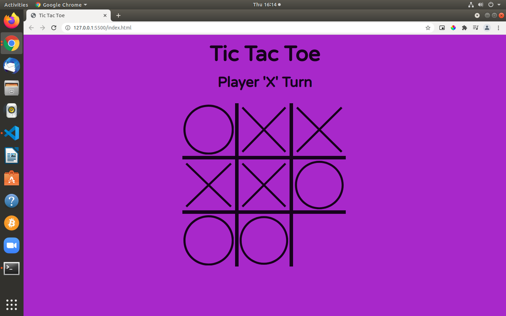

# Tic Tac Toe

> This project is a Tic Tac Toe game built using JavaScript. This is an assignment taken from _The Odin Project_. This game features two modes '1 Player' (where you can play against an AI) & '2 Player' (where you can choose the moves of both players).

### Tic Tac Toe Screenshot:



# Live Preview

[View Project](https://rawcdn.githack.com/jacobrees/Tic-Tac-Toe/69179f37b5ed630914709efea6ac4e89444a9b7e/index.html)

## How To Play Tic Tac Toe

In order to win the game, a player must place three of their marks in a horizontal, vertical, or diagonal row.

The following example game is won by player 'X':


For more information: [Wikipedia Tic-Tac-Toe](https://en.wikipedia.org/wiki/Tic-tac-toe)

## How The AI Works

The AI for the game was built using the Minimax Algorithm. 

This algorithm allows the AI to look ahead at possible future positions before deciding what move it wants to make at the current position.

For more information: [Wikipedia Minimax](https://en.wikipedia.org/wiki/Minimax)

# Getting Started

To get a local copy of the repository please run the following commands in your terminal:

```
$ cd <folder>
```

```
$ git clone git@github.com:jacobrees/Tic-Tac-Toe.git
```

To launch an instance of this game. Inside of your terminal you will need to navigate into the repository you have just cloned. You will do this by using `cd` inside of your terminal. 

Once you are inside of this folder run the command `google-chrome index.html` and this will open the project in Google Chrome (substitute google-chrome for your prefered web browser if you wish to open in a different browser). 

Below shows the following commands you will need to run to achieve this:

```
$ cd Tic-Tac-Toe
```

```
$ google-chrome index.html
```

## Built With

- HTML
- SCSS
- JavaScript

## Authors

👤 **Jacob Rees**

- Github: [@jacobrees](https://github.com/jacobrees)
- Linkedin: [jacob-rees-a6507b1a6](https://www.linkedin.com/in/jacob-rees-a6507b1a6/)


## 🤝 Contributing

Contributions, issues and feature requests are welcome!

## Show your support

Give a ⭐️ if you like this project!

## Acknowledgments

- Project inspired by The Odin Project
- Code linters used within this project have been developed by Microverse
